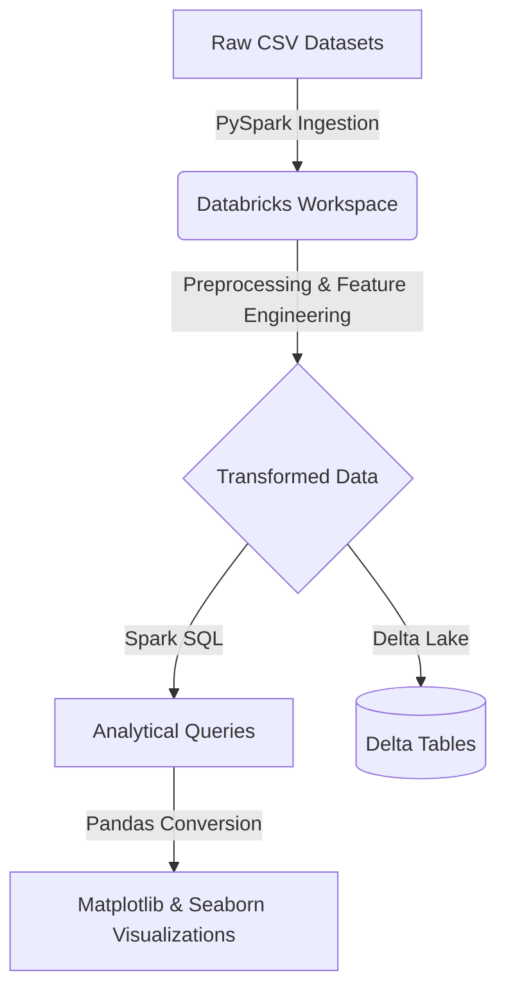

# IPL Data Engineering Pipeline

An end-to-end ETL workflow and analytics pipeline built in Databricks to process, analyze, and visualize Indian Premier League (IPL) cricket data.

## 🌟 Key Features

- **ETL Workflow:** Developed an ETL workflow using PySpark in Databricks to ingest, clean, and transform five massive IPL datasets (Ball-by-Ball, Match, Player, Player Match, and Team) for analytical processing.
- **Data Preprocessing & Feature Engineering:** Handled missing data, applied complex data transformations, and created derived features (e.g., match phases, boundary flags, player classifications) to support robust downstream analysis.
- **Advanced Analytics:** Used Spark SQL to perform joins, aggregations, filtering, and analytical queries to generate deep IPL performance insights such as death over strike rates and toss effectiveness.
- **Data Visualization & Storage:** Created interactive and static visualizations using Matplotlib and Seaborn (via Pandas DataFrames), and successfully loaded the transformed datasets into optimized Delta tables for further analysis.

## 🏗️ Architecture Diagram

## 🛠️ Tech Stack

**Databricks | PySpark | Spark SQL | Pandas | Matplotlib | Seaborn**

## 🚀 How to Run

1. Import `IPL_Analytics_Pipeline.py` into your Databricks workspace.
2. Ensure the following raw CSV files are uploaded to `/FileStore/tables/`:
   - `Ball_By_Ball.csv`
   - `Match.csv`
   - `Player.csv`
   - `Player_match.csv`
   - `Team.csv`
3. Execute the pipeline sequentially to ingest data, perform feature engineering, generate SQL insights, plot visualizations, and write to Delta tables.

## 📄 License
This project is open-source and available under the MIT License.
 
